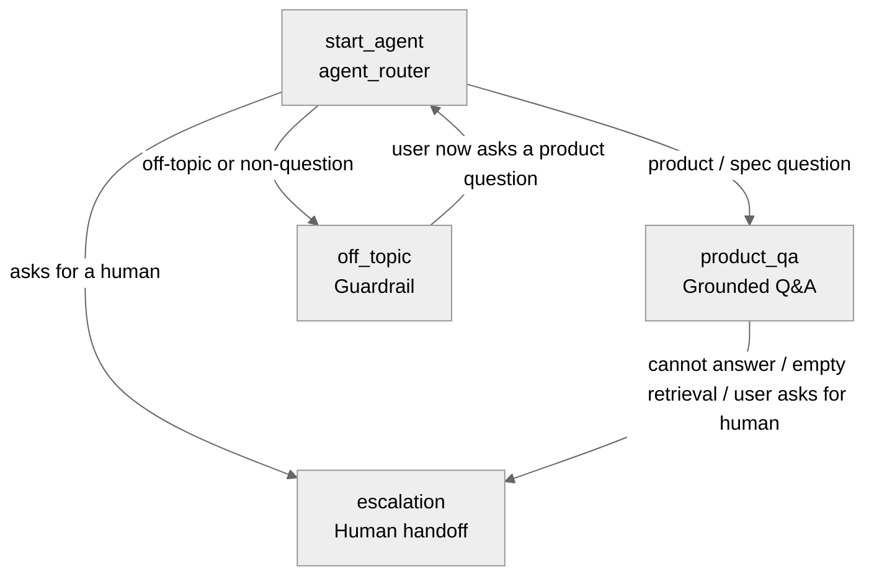

# Agent Spec: Vantor_Product_Concierge

## Purpose & Scope

A customer-facing service agent that answers questions about Vantor's geospatial
products — satellite imagery missions (the WorldView constellation), Vivid imagery
basemaps, and the software/analytics platforms (Sentry, Raptor, Cortex, Nexus,
Tensorglobe, Vantor Hub) — strictly grounded in the **`Vantor_Data_Sheets`**
Agentforce Data Library. It answers product/spec questions, cites the source
datasheet, declines anything off-topic, and hands off to a human when it cannot help.

Domain: Vantor (formerly Maxar / DigitalGlobe) geospatial imagery & analytics.

## Behavioral Intent

- **Grounded-only answers.** The agent answers exclusively from content returned by
  the `AnswerQuestionsWithKnowledge` action (the `Vantor_Data_Sheets` library). If the
  retrieval comes back empty, it must refuse rather than answer from model knowledge
  (anti-hallucination guard is the first instruction in the Q&A subagent).
- **Cite the source.** Citations are enabled; the agent names/links the source
  datasheet(s) when available and never fabricates links.
- **Stay in scope.** Off-topic or non-question requests (anything unrelated to Vantor
  products) are redirected by the `off_topic` guardrail subagent.
- **Human handoff.** When the agent cannot answer (empty retrieval, repeated failure,
  or the user asks for a person), it offers and performs a handoff to a human via
  `@utils.escalate`.
- **No persistent state required** across subagents — each turn is a stateless
  grounded lookup. (No customer record or session variables needed for v1.)

## Subagent Posture

| Subagent | Posture | Why this posture? | Deterministic controls |
|----------|---------|-------------------|------------------------|
| `agent_router` | mixed | Welcomes the user and classifies intent; routing is the only structured behavior | transition invariants only |
| `product_qa` | mixed | LLM composes natural answers, but a deterministic refuse-rule gates on empty retrieval | first-instruction anti-hallucination guard |
| `off_topic` | scripted | Fixed redirect message; no freedom needed | none |
| `escalation` | scripted | Single deterministic handoff to a human | `@utils.escalate` (permanent exit) |

## Subagent Map

- `agent_router → product_qa | off_topic | escalation`: **handoff** transitions.
- `product_qa → escalation`: **handoff** when retrieval is empty or the user requests a person.
- `off_topic → agent_router`: re-route once the user asks an in-scope question.

## Variables

None for v1. The grounded lookup is stateless per turn; no customer/session state is
required. (Future: a `failed_lookups` counter could proactively trigger escalation.)

## Actions

### AnswerQuestionsWithKnowledge (product_qa subagent)

- **Target:** `standardInvocableAction://streamKnowledgeSearch` (platform standard action)
- **Status:** EXISTS — real, platform-provided knowledge-retrieval action wired to the
  `Vantor_Data_Sheets` library. **Not a stub.**

#### Inputs

| Name | Type | Required | Source |
|------|------|----------|--------|
| query | string | Yes | User input (LLM-composed search query) |
| citationsUrl | string | No | `@knowledge.citations_url` (empty) |
| ragFeatureConfigId | string | No | `@knowledge.rag_feature_config_id` = `ARFPC_1JDU900000072ujOAA` |
| citationsEnabled | boolean | No | `@knowledge.citations_enabled` = True |

#### Outputs

| Name | Type | Visible to User? | Source | Notes |
|------|------|------------------|--------|-------|
| knowledgeSummary | object | Yes | ADL retriever | Rich-text answer + citations; drives the response |
| citationSources | object | Yes | ADL retriever | Source datasheet links |

### escalate (escalation subagent)

- **Target:** `@utils.escalate` (built-in)
- **Status:** EXISTS — built-in human-handoff utility. Permanent exit; session ends.
- No inputs/outputs.

## Action Invocation Strategy

| Action | Subagent | Invocation Mode | Why |
|--------|----------|-----------------|-----|
| AnswerQuestionsWithKnowledge | product_qa | Planner slot-fill (`with query = ...`) | LLM composes the search query from the user's question each turn |
| escalate | escalation | Planner action | Fires when the agent confirms a handoff |

## Deterministic Controls (When Needed)

- **Anti-hallucination refuse-rule** (first instruction in `product_qa`): if
  `@outputs.AnswerQuestionsWithKnowledge.knowledgeSummary` is empty/None, respond with a
  fixed refusal + handoff offer; do NOT compose from prior knowledge. Cause: grounded /
  trust-sensitive corpus — wrong specs (e.g., resolution, revisit time) are unacceptable.
- **`knowledge:` block** pins grounding to `ARFPC_1JDU900000072ujOAA` with citations on.

## Architecture Pattern

Router-first. `agent_router` welcomes and classifies into one of three subagents:
`product_qa` (the core grounded Q&A domain), `off_topic` (scope guardrail), and
`escalation` (human handoff). `product_qa` can hand off to `escalation` when it cannot
answer. No linear workflow; each Q&A turn is an independent grounded lookup.

## Knowledge Grounding

- **Library:** `Vantor_Data_Sheets` (`developerName`), `libraryId` `1JDU900000072ujOAA`
- **rag_feature_config_id:** `ARFPC_1JDU900000072ujOAA`
- **Status:** READY — `retrieverId` `1CxU90000005vyXKAQ` (live), 18 datasheets indexed
- **Files include:** WorldView (2D, 3, Radar, Rapid Access, Direct Access, Space),
  Vivid (Mosaic, Terrain, Features, base), Sentry, Raptor, Cortex, Nexus, Tensorglobe,
  Vantor Hub.
- **Citations:** enabled; `citations_url` empty.

## Agent Configuration

- **developer_name:** `Vantor_Product_Concierge`
- **agent_label:** `Vantor Product Concierge`
- **agent_type:** `AgentforceServiceAgent` — customer-facing; requires `default_agent_user`.
- **default_agent_user:** `agent.user.266e881435f2@salesforce.com.uptimadev`
  (the active "Agentforce Service Agent" Einstein Agent User). **Must be assigned a Data
  Cloud permset/PSL for grounding to work at runtime** — verified before release.
- **Welcome message:** "Hi! I can answer questions about Vantor's imagery products and
  platforms — WorldView satellites, Vivid basemaps, Sentry, Raptor, and more. What would
  you like to know?"
- **Error message:** "Something went wrong searching the Vantor datasheets. Please try
  again, or I can connect you with a person."

## Testing (testing-agentforce)

After build & live-preview smoke tests, create an `AiEvaluationDefinition` test suite
covering: grounded product-spec Q&A (multiple products/phrasings), citation presence,
empty-retrieval refusal, off-topic redirection, and human-handoff request.
